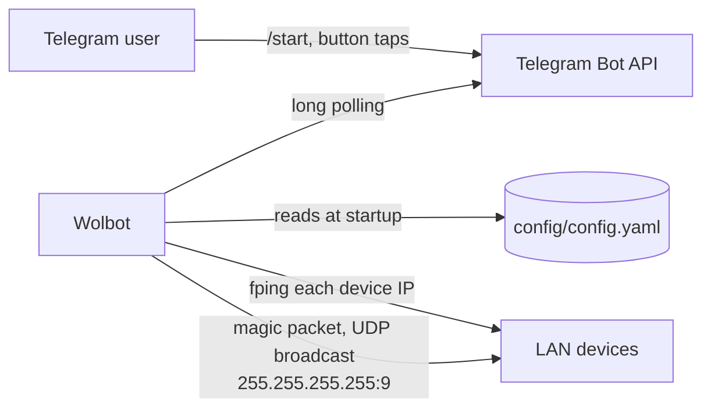

# wolbot

Wolbot is a Python-powered Telegram bot for Wake-on-LAN tasks. It lists the computers on your
network with their current status (online/offline) and sends a Wake-on-LAN magic packet to any
of them with a single tap. It is meant for home labs and small networks where you want to wake
a machine remotely without exposing anything to the internet: the bot only makes outbound
connections to Telegram.

## Table of contents

- [Features](#features)
- [How it works](#how-it-works)
- [Components and frameworks used in Wolbot](#components-and-frameworks-used-in-wolbot)
- [Requirements](#requirements)
- [Installing Wolbot](#installing-wolbot)
- [Configuration](#configuration)
- [Using Wolbot](#using-wolbot)
- [Troubleshooting](#troubleshooting)
- [Security notes](#security-notes)
- [Development](#development)
- [Contributing](#contributing)
- [License](#license)

## Features

- List devices (All/Online/Offline) with their status (✅ online, ❌ offline, ❓ unknown).
- Send a magic packet to wake up a device with one tap.
- Inline-keyboard menu: no commands to remember besides `/start` or `/help`.
- Access limited to a list of allowed Telegram chat IDs (see the limitations in
  [Security notes](#security-notes)).
- Devices are defined in a simple YAML file.
- Docker images for `linux/amd64`, `linux/arm64` and `linux/arm/v7`.

## How it works



1. Wolbot connects to Telegram with long polling (`infinity_polling`). It opens no listening
   port and needs no webhook or port forwarding.
2. At startup it loads the device list from `config/config.yaml`.
3. When you open a list, it runs `fping` once against the `ip` of every configured device and
   marks each one online, offline or unknown.
4. When you tap a device, it sends a magic packet to that device's MAC address with the
   [wakeonlan](https://pypi.org/project/wakeonlan/) library, using the library defaults: a UDP
   broadcast to `255.255.255.255`, port `9`. The broadcast address and port are not
   configurable.

## Components and frameworks used in Wolbot

* [Loguru](https://pypi.org/project/loguru/) a library which aims to bring enjoyable logging in Python.
* [PyYAML](https://pypi.org/project/PyYAML/) a data serialization format designed for human readability and interaction with scripting languages.
* [pyTelegramBotAPI](https://pypi.org/project/pyTelegramBotAPI/) a simple, but extensible Python implementation for the Telegram Bot API.
* [wakeonlan](https://pypi.org/project/wakeonlan/) a small Python module for Wake-on-LAN.
* [fping](https://fping.org/) (system package) used to check whether each device is online.

## Requirements

- A Telegram bot token (see [step 1](#installing-wolbot) below).
- The numeric Telegram chat ID(s) allowed to use the bot. For a private chat with the bot this
  is your own Telegram user ID.
- A host on the **same LAN (broadcast domain)** as the computers you want to wake.
- Target computers with Wake-on-LAN enabled in the BIOS/UEFI and on the network adapter.
- One of:
  - Docker (the image already contains Python and `fping`), or
  - Python 3 with `pip`, plus `fping` installed on the host (for example `apt install fping`).

## Installing Wolbot

Wolbot can be installed and run as a Docker container or as a systemd service.

1. Create a new Telegram bot and get the token.

    Open [Telegram messenger](https://web.telegram.org/), sign in to your account or create a new one.

    Enter @BotFather in the search tab and choose this bot (official Telegram bots have a blue checkmark beside their name).

    [](https://github.com/t0mer/voicy/blob/main/screenshots/scr1-min.png?raw=true "@BotFather")

    Click “Start” to activate the BotFather bot.

    [](https://github.com/t0mer/voicy/blob/main/screenshots/scr2-min.png?raw=true "@start")

    In response, you receive a list of commands to manage bots.
    Choose or type the /newbot command and send it.

    [](https://github.com/t0mer/voicy/blob/main/screenshots/scr3-min.png?raw=true "@newbot")

    Choose a name for your bot — your subscribers will see it in the conversation. Then choose a username for your bot — the bot can be found by its username in searches. The username must be unique and end with the word “bot”.

    [](https://github.com/t0mer/voicy/blob/main/screenshots/scr4-min.png?raw=true "@username")

    After you choose a suitable name for your bot, the bot is created. You will receive a message with a link to your bot t.me/<bot_username>, recommendations to set up a profile picture, description, and a list of commands to manage your new bot.

    [](https://github.com/t0mer/voicy/blob/main/screenshots/scr5-min.png?raw=true "@bot_username")

2. Update the configuration file with the list of computers. The file must be placed under the
   **config** folder as `config/config.yaml` (see [Configuration](#configuration) for details):
   ```yaml
   computers:
     - name: Office-PC
       ip: 192.168.1.10
       mac: "AA:BB:CC:DD:EE:FF"
   ```

3. Set the following environment variables:
    - `BOT_TOKEN` — the Telegram bot token generated in the previous step.
    - `ALLOWED_IDS` — the Telegram chat IDs allowed to communicate with the bot, comma-separated.

4. If you want to run Wolbot as a ***Docker container***, use Docker Compose or `docker run`.

    > [!WARNING]
    > **Known issue: the published image does not start as-is.** The image's entrypoint is
    > `/usr/bin/python3 /app/app.py`. In the image, `/usr/bin/python3` is Debian's system Python,
    > but the dependencies were installed with pip for `/usr/local/bin/python3`. The container
    > therefore exits at startup with `ModuleNotFoundError: No module named 'loguru'`.
    >
    > Workaround: override the entrypoint so the image's own `python3` is used, as shown in the
    > examples below (`entrypoint: ["python3", "/app/app.py"]` in Compose, or
    > `--entrypoint python3 ... /app/app.py` with `docker run`). With that interpreter the
    > dependencies import correctly, but a full run (Telegram connection, waking a device) has
    > **not been tested**. Running [from source](#installing-wolbot) (step 5) is the reliable path
    > until the image is fixed.

    > **Host networking is required.** The magic packet is a UDP broadcast. On Docker's default
    > bridge network the broadcast stays inside the Docker network and never reaches your LAN,
    > so the bot reports success but nothing wakes up. Run the container with
    > `network_mode: host` / `--network host` (Linux hosts).

    **Docker Compose** — copy the following into your `docker-compose.yaml`:
    ```yaml
    services:
      wolbot:
        image: techblog/wolbot:latest
        container_name: wolbot
        restart: always
        network_mode: host
        # Workaround for the known entrypoint issue (not tested end-to-end)
        entrypoint: ["python3", "/app/app.py"]
        environment:
          - BOT_TOKEN=<your-bot-token>
          - ALLOWED_IDS=<chat-id-1>,<chat-id-2>
        volumes:
          - ./config:/app/config
    ```
    Make sure to set all the environment variables before running `docker compose up -d`.

    **docker run**:
    ```bash
    docker run -d \
      --name wolbot \
      --restart always \
      --network host \
      --entrypoint python3 \
      -e BOT_TOKEN=<your-bot-token> \
      -e ALLOWED_IDS=<chat-id-1>,<chat-id-2> \
      -v "$(pwd)/config:/app/config" \
      techblog/wolbot:latest \
      /app/app.py
    ```
    `--entrypoint python3` plus the trailing `/app/app.py` is the workaround for the known
    entrypoint issue above (not tested end-to-end).

    The configuration is read from `/app/config/config.yaml` inside the container. If the mounted
    `config` folder is empty, Wolbot copies a blank template into it on first start; edit that
    file and restart the container.

5. If you want to run Wolbot as a ***systemd service*** (or directly from source), clone the
   repository. The examples below use `/opt/wolbot`; adjust the path to your location:
    ```bash
    git clone https://github.com/t0mer/wolbot /opt/wolbot
    ```
    Enter the *wolbot* folder, create a virtual environment and install the dependencies into
    it, then install `fping`:
    ```bash
    cd /opt/wolbot
    python3 -m venv .venv
    .venv/bin/pip install -r requirements.txt
    sudo apt install fping
    ```
    A virtual environment is recommended: on recent Debian/Ubuntu releases a system-wide
    `pip3 install` is refused with an `externally-managed-environment` error
    ([PEP 668](https://peps.python.org/pep-0668/)).

    To try it out in the foreground, run it from the `app` folder (the configuration path is
    relative to the working directory):
    ```bash
    cd app
    BOT_TOKEN=<your-bot-token> ALLOWED_IDS=<chat-id> ../.venv/bin/python app.py
    ```

    To run it as a service, create a file named **"wolbot.service"** under **/etc/systemd/system** and paste the following content:

    ```ini
    [Unit]
    Description=Wake On Lan bot
    After=network-online.target
    Wants=network-online.target systemd-networkd-wait-online.service
    StartLimitIntervalSec=5
    StartLimitBurst=5

    [Service]
    EnvironmentFile=/etc/environment
    KillSignal=SIGINT
    WorkingDirectory=/opt/wolbot/app/
    Type=simple
    User=root
    ExecStart=/opt/wolbot/.venv/bin/python /opt/wolbot/app/app.py
    Restart=always

    [Install]
    WantedBy=multi-user.target
    ```
    ***Make sure to adjust the paths for "WorkingDirectory" and "ExecStart" to the location of Wolbot.***
    `ExecStart` must use the virtual environment's Python (`.venv/bin/python`), where the
    dependencies are installed.
    `WorkingDirectory` must point to the `app` folder, because Wolbot looks for
    `config/config.yaml` relative to it. The unit reads `BOT_TOKEN` and `ALLOWED_IDS` from
    `/etc/environment`; set them there (or point `EnvironmentFile` at a dedicated file).

    Next, run the following commands to enable and start the service:
    ```bash
    systemctl enable wolbot.service
    systemctl start wolbot.service
    ```
    To check the status of the service, run the following command:
    ```bash
    systemctl status wolbot.service
    ```

## Configuration

### Environment variables

| Variable | Required | Default | Description |
|----------|----------|---------|-------------|
| `BOT_TOKEN` | Yes | none | Telegram bot token from @BotFather. |
| `ALLOWED_IDS` | Yes | none | Comma-separated Telegram chat IDs allowed to use the bot, for example `123456789,987654321`. If it is not set, the bot ignores every message. The check is a substring match on the raw value, not an exact match per ID; see [Security notes](#security-notes). |

There are no command-line flags. Everything else comes from the configuration file.

### Configuration file

Wolbot reads the device list from **`config/config.yaml`, relative to the working directory**
(`/app/config/config.yaml` in the Docker image, `app/config/config.yaml` when run from source).

| Key | Required | Description |
|-----|----------|-------------|
| `computers` | Yes | List of devices shown in the bot. |
| `computers[].name` | Yes | Label shown on the device's button. |
| `computers[].ip` | Yes | IP address checked with `fping` to show the online/offline status. It is **not** used for sending the magic packet. |
| `computers[].mac` | Yes | MAC address the magic packet is sent to, for example `"AA:BB:CC:DD:EE:FF"`. **Always quote it.** |

Example:

```yaml
computers:
  - name: Office-PC
    ip: 192.168.1.10
    mac: "AA:BB:CC:DD:EE:FF"
  - name: Media-Server
    ip: 192.168.1.20
    mac: "11:22:33:44:55:66"
```

Notes:

- Always put the MAC address in quotes. An unquoted MAC made only of digits, such as
  `11:22:33:44:55:66`, is read by YAML as a base-60 integer instead of a string, and building
  the device list then fails (no device buttons appear).
- There are no settings for the broadcast address or port. Magic packets always go to
  `255.255.255.255`, UDP port `9`.
- The file is read once at startup. Restart Wolbot after changing it.
- Use an IP address for `ip`. The status check filters `fping` output lines that contain a
  `-`, so a host name with a hyphen always shows as offline.

### Why are there two `config.yaml` files?

- `app/config/config.yaml` is the file Wolbot actually reads at runtime.
- `app/config.yaml` is a blank template. When `config/config.yaml` does not exist (for example,
  when an empty folder is mounted on `/app/config`), Wolbot copies this template to
  `config/config.yaml` and loads it.

Both files in the repository are empty templates. Fill in `config/config.yaml` (or the file in
your mounted `config` folder) with your own devices.

## Using Wolbot

To start using **Wolbot**, send one of the following commands: **/start** or **/help**.
A shortcut menu will be opened, with four options:

* Show all computers.
* Show online computers.
* Show offline computers.
* Cancel.


Click on one of the first three options, and a list of computers will be displayed. Each list
pings all configured devices first, so it may take a moment to appear. Devices whose status is
unknown (❓) appear only under "Show all computers".


Click on one of the computers to wake it up. Wolbot replies with "The magic packet sent
successfully." (or "Unable to send magick packet." on error) and shows the main menu again.
**Back ↩** returns to the main menu, and **Cancel** removes the menu.


"Sent successfully" means the packet left the Wolbot host. It does not confirm that the
computer woke up; open the list again after a short while to check its status.

## Troubleshooting

| Symptom | Likely cause |
|---------|--------------|
| The bot does not answer `/start` | Your chat ID is not in `ALLOWED_IDS`, or `ALLOWED_IDS` is not set. A chat that is not allowed is ignored silently, with no log line. An unset `ALLOWED_IDS` only shows up in the logs as a caught `TypeError`. Also check `BOT_TOKEN`. |
| The container exits at startup with `ModuleNotFoundError: No module named 'loguru'` | Known issue in the published image: its entrypoint uses Debian's `/usr/bin/python3`, which cannot see the pip-installed packages. Override the entrypoint (see the [warning](#installing-wolbot) in step 4) or run from source. |
| "The magic packet sent successfully." but the computer does not wake up | The container is not using host networking, the Wolbot host is on a different subnet/VLAN than the target, or Wake-on-LAN is disabled in the target's BIOS/UEFI or network adapter settings. Also check the MAC address. |
| Every device shows as online | `fping` is not installed (running from source). Install it with `apt install fping`. |
| A device always shows as offline | The `ip` is wrong, the device blocks ICMP echo, or `ip` is a host name containing `-`. Use the IP address. |
| The list is empty or has no device buttons | The configuration file is missing, has an invalid format, contains an entry with an empty `name`/`ip`/`mac` (such as the blank template), or has an unquoted MAC address that YAML parsed as a number. Check the log line `N Computers Loded` at startup. |
| Configuration changes have no effect | The file is read only at startup. Restart the container or service. |

## Security notes

- Always set `ALLOWED_IDS` and keep it limited to the chats that should be able to wake your
  machines. Prefer a private chat with the bot over a group, since every member of an allowed
  group can use the buttons.
- Know the limits of the allowlist:
  - The check is a substring match on the raw `ALLOWED_IDS` string, not an exact match per
    ID. A chat whose ID appears inside another allowed ID (for example `123` when
    `ALLOWED_IDS=91234`) is also let in. Double-check the list and avoid short IDs.
  - Only `/start`, `/help` and the list/Back buttons check `ALLOWED_IDS`. The wake (device)
    button and **Cancel** do not check it at all; they rely on the fact that only allowed chats
    receive the menu.
- Keep `BOT_TOKEN` secret. Anyone with the token can control the bot. If it leaks, revoke it
  with @BotFather (`/revoke`).
- Host networking gives the container direct access to the host's network interfaces. Run
  Wolbot on a trusted host, and keep your real `config.yaml` and environment files out of
  version control.
- Wolbot needs no inbound ports. Only outbound HTTPS to the Telegram Bot API is required.

## Development

### Project layout

```
app/
  app.py              # bot, handlers, fping status check and magic packet sending
  computer.py         # Computer data class (name, mac, ip, status)
  config.yaml         # blank template, copied to config/ when missing
  config/config.yaml  # configuration read at runtime
Dockerfile            # python:latest base, installs fping and requirements.txt
requirements.txt      # loguru, requests, pyyaml, pyTelegramBotAPI, wakeonlan
VERSION               # version used for image tags
.github/workflows/    # image publishing workflows
screenshots/          # README screenshots
```

### Run locally

```bash
python3 -m venv .venv
.venv/bin/pip install -r requirements.txt
cd app
BOT_TOKEN=<your-bot-token> ALLOWED_IDS=<chat-id> ../.venv/bin/python app.py
```

There is no test suite.

### Build the Docker image

```bash
docker build -t wolbot .
```

The image is based on `python:latest`, installs `fping` and the Python requirements, copies
`app/` to `/app` and starts `app.py`. It runs as root and declares no volume, so mount
`/app/config` yourself.

> [!WARNING]
> **Known issue:** the Dockerfile's `ENTRYPOINT ["/usr/bin/python3", "/app/app.py"]` starts
> Debian's system Python, which cannot see the packages pip installed for
> `/usr/local/bin/python3`. The published image therefore exits with
> `ModuleNotFoundError: No module named 'loguru'`. Override the entrypoint as described in
> [Installing Wolbot](#installing-wolbot) (not tested end-to-end), or run from source. A local
> build from this Dockerfile is likely affected in the same way.

Other Dockerfile notes:

- `EXPOSE 8081` is unused. Wolbot does not listen on any port.
- `ENV ALLOWD_IDS ""` is a misspelt, unused variable. The image sets no default for
  `ALLOWED_IDS`, so you must set `ALLOWED_IDS` explicitly.

### Workflows

All workflows are started manually (`workflow_dispatch`) and tag images with the content of
the `VERSION` file unless noted otherwise.

| Workflow | File | Publishes | Platforms |
|----------|------|-----------|-----------|
| Docker Build | `docker-image.yml` | `techblog/wolbot:latest` and `techblog/wolbot:<VERSION>` on Docker Hub. Also set to run after a workflow named "Create Release", which does not exist in this repository. | `linux/amd64`, `linux/arm64`, `linux/arm/v7` |
| JCR Docker Build | `jcr.yml` | `<private JCR registry>/docker/wolbot:latest` and `:<VERSION>` on a private JFrog Container Registry. | `linux/amd64`, `linux/arm64` |
| Publish to GHCR | `publish-ghcr.yml` | `ghcr.io/t0mer/wolbot:latest` and `ghcr.io/t0mer/wolbot:<tag input>` (default `latest`). | `linux/amd64`, `linux/arm64`, `linux/arm/v7` |

### Published images

| Registry | Tags | Platforms |
|----------|------|-----------|
| [Docker Hub `techblog/wolbot`](https://hub.docker.com/r/techblog/wolbot) | `latest`, `1.0.0` | `linux/amd64`, `linux/arm64`, `linux/arm/v7` |

Both published tags are affected by the entrypoint known issue above and do not start without
the entrypoint override.

The `VERSION` file says `1.1.0`, but no `1.1.0` image or release has been published yet. The
latest GitHub release is [1.0.0](https://github.com/t0mer/wolbot/releases/tag/1.0.0). No image
has been published to GHCR yet.

## Contributing

Issues and pull requests are welcome. Please keep changes focused, describe how you tested
them, and never commit a real bot token, chat IDs or your own device list.

## License

Wolbot is licensed under the [GNU General Public License v3.0](LICENSE).
